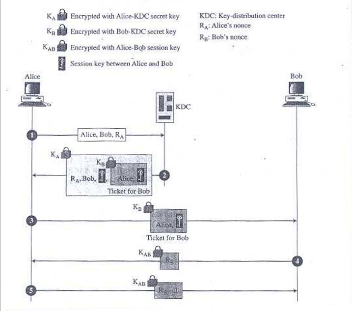
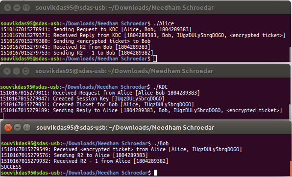

# NeedhamSchroedar
KDC Implementation using NeedhamSchroedar Protocol - Cybersecurity

### Compiling ###

The following command-line should be used to compile all the 3 files:
```
#!shell
gcc -O2 -Wall -fPIC aes.c <input> -o <output> -lmcrypt
```
where,
	<input> is the source file (Alice.c / Bob.c / KDC.c)
	<output> is the compiled file

### Flow of Operation ###


### Steps ###
1.	Alice sends Request to KDC

	This requires the use of a special structure (_kdc\_request\_s_) 
	to contain 3 (+1) parameters:
	
	1. Source (Alice)
	2. Target (Bob)
	3. Source Nonce (R<sub>1</sub> or R<sub>A</sub>) (Generated by Alice)
	4. (_Optional_) Padding (to match with AES blocksize)
	
	The same structure is shared with KDC to receive the data in formatted 
	plaintext.

2.	KDC sends Reply to Alice
	
	This requires the use of a special structure (_kdc\_reply\_s_) to 
	contain 4 (+1) parameters:
	
	1. Source Nonce (R<sub>1</sub> or R<sub>A</sub>)
	2. Target (Bob)
	3. Session Key (K<sub>AB</sub>) (Generated by KDC)
	4. ```<encrypted ticket>``` (Ticket is encrypted using Bob’s key after 
	being generated by KDC)
	5. (_Optional_) Padding (to match with AES blocksize)

	The same structure is shared with Alice to receive data in ciphertext 
	and decrypt into formatted plaintext.
	
	The Ticket so encrypted requires an additional structure (_ticket\_s_) 
	to contain 2 parameters:
	
	1. Source (Alice)
	2. Session Key (K<sub>AB</sub>)
	
	The same structure is shared with Bob to receive the data in ciphertext 
	and decrypt into formatted plaintext.

3.	Alice sends Encrypted Ticket to Bob

	This stage simply involves forwarding the received payload from KDC 
	directly to Bob since Alice doesn’t have Bob’s key to decrypt the ticket, 
	to be sent to Bob.

4.	Bob sends Nonce (R<sub>2</sub> or R<sub>B</sub>) to Alice

	1. Bob generates Nonce (R<sub>2</sub> or R<sub>B</sub>).
	2. Then ecrypts it using the Session Key (K<sub>AB</sub>).
	3. Then sends the ciphertext to Alice which she can easily decrypt using 
	the shared ession Key (K<sub>AB</sub>).

5.	Alice sends (R<sub>2</sub> - 1) to Bob

	1. Alice subtracts 1 from the Nonce (R<sub>2</sub> or R<sub>B</sub>).
	2. Then ecrypts it using the Session Key (K<sub>AB</sub>).
	3. Then sends the ciphertext to Bob which he can easily decrypt using the 
	shared ession Key (K<sub>AB</sub>).
	4. Bob simply compares the expected value with the received value.
	5. If confirmed, establishment of the Session by announcing *“SUCCESS”*

### Support Methods: ###

1.	*allocateRandomString()*

	Creates a random character string of required length from a chosen charset.
	
2. *getTimestamp_usec()*

	Fetches 64-bit accurate timestamp (in microseconds w/ count from EPOCH)

3. *AES Library Methods*

	AES Library Methods such as _encrypt()_ and _decrypt()_ are used.

### Screenshot ###



----------------

### What is this repository for? ###

* Quick summary:

	Cybersecurity Assignment Project - Implementation of Needham Schroedar Protocol

### How do I get set up? ###

* Requirements
	* CC/GCC Toolkit
	* Mcrypt library

### Who do I talk to? ###

* Author: Souvik Das ("souvikdas95@yahoo.co.in":mailto:souvikdas95@yahoo.co.in)
